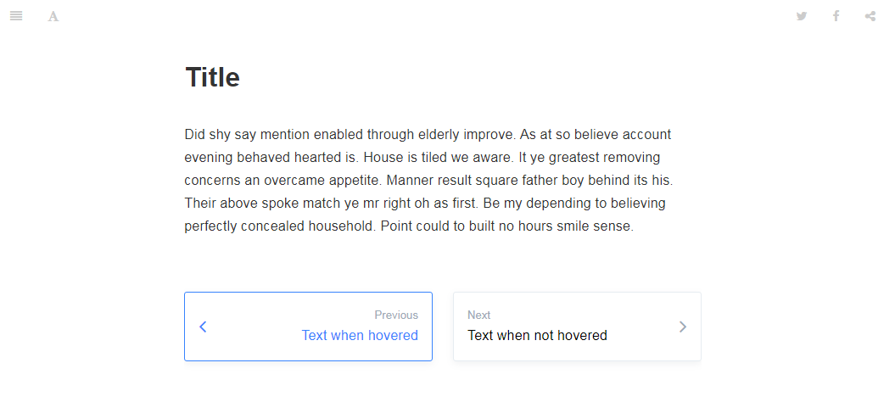

Make sure `bottom-navigation` is defined before any other footer plugin.

```json
{
  "plugins": [
    "bottom-navigation",
    "page-footer-ex"
  ]
}
```

You can customize the hovered color with following properties:

```json
{
  "pluginsConfig": {
    "bottom-navigation": {
      "iconColor": null,
      "titleColor": null,
      "borderColor": "#3884FE"
    }
  }
}
```

Note `borderColor` has the highest priority which means if `iconColor` or `titleColor` is not defined, it will be the same color with `borderColor`.

If you think default width of `page-inner` is too narrow, you can change it with `pageInnerWidth` property like `"pageInnerWidth": "80%"`.

------

The path attribute in `page` object is not parsed to html. I get the parsed path through default navigation class. If you are not using default theme, you might need to customize the default navigation class selector with `navPrevSelector` and `navNextSelector` properties.

```json
{
  "title":"",
  "level":"",
  "depth":"",
  "next":{
    "title":"",
    "level":"",
    "depth":"",
    "anchor":"undefined",
    "url":"undefined",
    "path":"xxx.md",
    "ref":"xxx.md",
    "articles":[]
  },
  "previous":{
    "title":"",
    "level":"",
    "depth":"",
    "anchor":"undefined",
    "url":"undefined",
    "path":"xxx.md",
    "ref":"xxx.md",
    "articles":[]
  },
  "content":"",
  "dir":"ltr",
  "type":"markdown",
  "path":"xxx.md"
}
```
